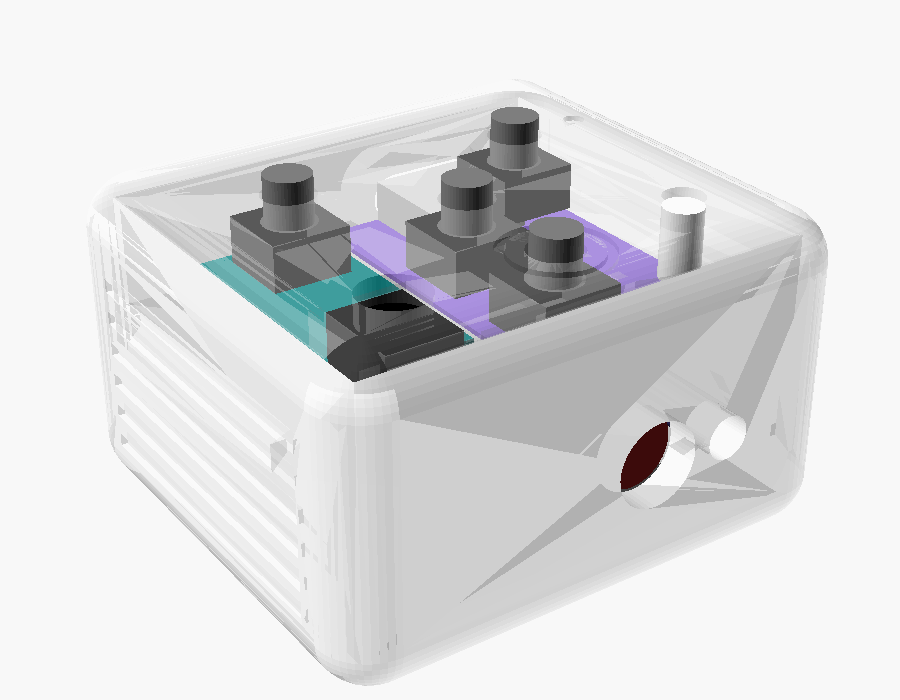
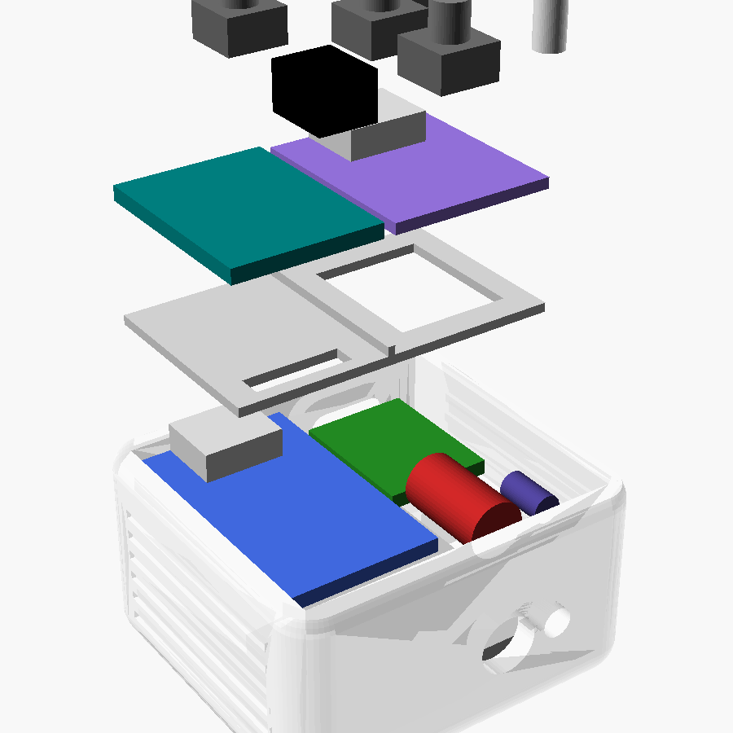
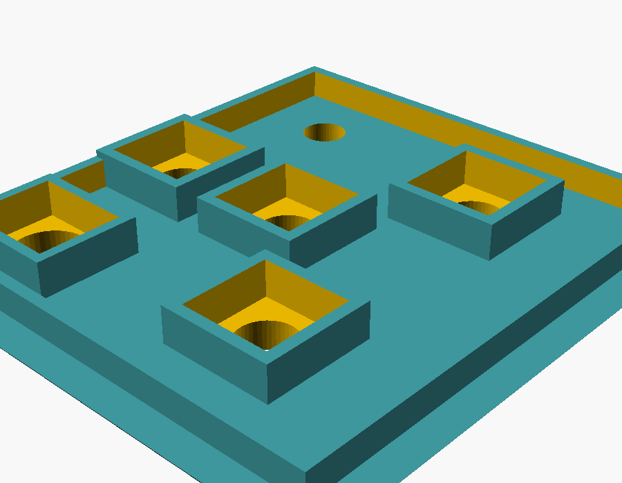
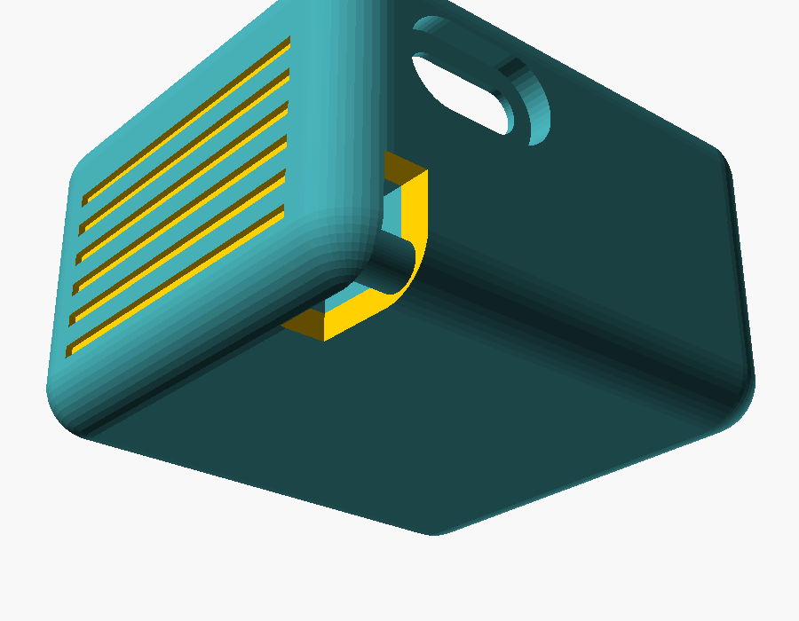

# Caixa do chaveiro

Caixa imprimível da [versão chaveiro](../../docs/CHAVEIRO_C6.md): 40,4 × 37 ×
24,5 mm, com todas as quinas arredondadas, estrias nas laterais e um rasgo
discreto no canto traseiro de baixo para a argola do chaveiro.



> Os STL foram gerados e conferidos no OpenSCAD (as três peças saem fechadas,
> sem erro), mas **nenhuma foi impressa ainda**. As medidas da bateria foram
> estimadas por foto — meça a sua antes de imprimir.

---

## Arquivos

| Arquivo | O que é |
|---|---|
| [air_mouse_case.scad](air_mouse_case.scad) | Modelo paramétrico (OpenSCAD) |
| [stl/air_mouse_base.stl](stl/air_mouse_base.stl) | Base: paredes, fundo, furos do laser e do LED IR, USB-C, rasgo da argola |
| [stl/air_mouse_tampa.stl](stl/air_mouse_tampa.stl) | Tampa: furos dos botões, janela do receptor IR, LED. Já vem virada para imprimir |
| [stl/air_mouse_bandeja.stl](stl/air_mouse_bandeja.stl) | Bandeja que segura o MPU6050 e a XIAO firmes, acima da bateria |

---

## Antes de imprimir: meça

Abra o `.scad` no [OpenSCAD](https://openscad.org) (gratuito) e ajuste no topo
do arquivo, na seção *Bateria com o TP4056 colado*:

| Parâmetro | Valor usado | O que medir |
|---|---|---|
| `bat_larg` | 30 mm | Largura da bateria |
| `bat_comp` | 30 mm | Comprimento, da ponta com a proteção até o lado do USB do TP4056 |
| `bat_esp` | 5,0 mm | Espessura, sem o TP4056 |
| `tp_larg` / `tp_comp` | 17,5 / 28 mm | Placa do TP4056 |
| `tp_recuo` | 0 mm | Quanto o USB do TP4056 fica para dentro da borda da bateria |
| `mpu_larg` / `mpu_comp` | 16 / 21 mm | Placa do GY-521, sem os pinos |

Depois de ajustar, escolha a peça em `peca` (base, tampa ou bandeja),
renderize com **F6** e exporte com **F7**. Pela linha de comando:

```bash
openscad -D 'peca="base"' -o air_mouse_base.stl air_mouse_case.scad
```

---

## Impressão

| Ajuste | Valor |
|---|---|
| Material | PETG (mais resistente a queda e calor) ou PLA |
| Altura de camada | 0,2 mm |
| Perímetros | 3 ou mais |
| Preenchimento | 20% |
| Suporte | **Nenhum** |

Orientação: a base com o fundo na mesa, a tampa com o topo na mesa (o STL já
sai assim) e a bandeja deitada. A barrinha da argola, o teto do bolsinho da
argola e o topo dos furos imprimem como ponte, sem suporte.

A tampa encaixa por pressão, com 0,15 mm de folga. Se ficar apertada, lixe a aba;
se ficar solta, um ponto de cola resolve.

---

## Onde vai cada coisa



De baixo para cima:

1. **Bateria com o TP4056**, com o USB do TP4056 virado para trás. Isole com
   fita kapton.
2. **Laser e LED IR** deitados na faixa livre da bateria, ao lado do TP4056,
   apontando para os furos da frente. A plaquinha dos transistores fica logo
   atrás deles. Fixe com cola quente.
3. **Bandeja**, apoiada nos ressaltos das paredes. Cole nos ressaltos.
4. **MPU6050** (à esquerda) e **XIAO** (à direita) lado a lado na bandeja, com o
   USB-C da XIAO encostado no furo de trás. Cole o MPU firme. Os fios dos pads de
   baixo da XIAO passam pela janela da bandeja.
5. **Na tampa**: os 4 botões encaixados por baixo nos soquetes, o receptor IR
   deitado com a lente para cima e o LED RGB no furo da frente à direita.



Monte e teste em etapas, como em [MONTAGEM.md](../../docs/MONTAGEM.md): ligue
o MPU e confira o cursor na bancada antes de colar qualquer coisa.

---

## Argola do chaveiro



O rasgo de 3,4 mm no canto traseiro de baixo (lado direito) tem uma barrinha
escondida onde a argola abraça. Por dentro, um bolsinho fechado impede a argola
de encostar na bateria ou nos fios.

Pela simulação do caminho da argola, cabem argolas de até **25 mm com arame de
2 mm**, ou até **30 mm com arame de 1,5 mm**. Passe a argola girando, como se
coloca uma chave.
